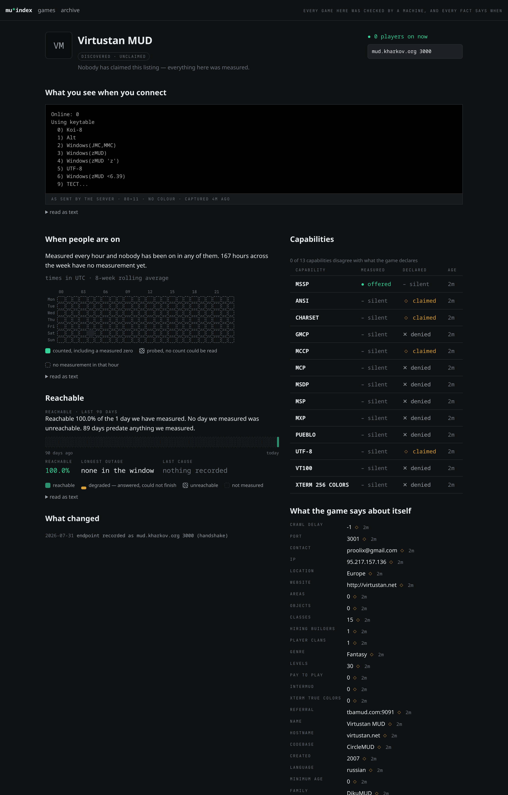

# MUIndex

An information site for the MU\* hobby — MUSHes, MUDs, MUCKs, MOOs — whose distinguishing property
is that **its data is measured rather than asserted**.

Every fact on a game's page carries how it was obtained and how old it is. The catalogue is a
by-product of continuous measurement, not a form somebody filled in once.

> **Status: joined end to end.** `mui-crawl` probes live servers into PostgreSQL and the site renders
> that database — sixteen real games, measured, in [`docs/screenshots/`](docs/screenshots/). Referral
> discovery has been walked in the wild: two of 141 live servers publish `REFERRAL`, and the endpoints
> they name became depth-1 targets and were probed without being seeded. Not yet deployed.
>
> A run against real servers immediately found three sentences the fixture could not: a percentage
> claiming ninety days of evidence from one probe, an empty heatmap cell asserting downtime it had not
> measured, and an internal digest presented as something a game said about itself. That is the
> argument for measuring rather than asserting, turned on the site itself.

Short form **MUI**, which is also the assembly prefix.

---

## Why

Every incumbent MU\* directory fails the same three ways.

| | Failure |
|---|---|
| **Unbounded moderation queues** | Listings sit "awaiting approval" for a year, so the catalogue never fills. |
| **Vote-driven rankings** | Gameable, then gamed, then worthless. Top Mud Sites became a link graveyard this way. |
| **Silent staleness** | No distinction between *listed*, *verified*, and *last seen alive*. Dead games sit beside live ones indefinitely. |

The sharpest illustration: MudStats went dark in late 2022 and returned in Sept 2024; The MUD
Connector died and returned in Jul 2023. **No directory noticed automatically — including their
own.** A returning game should re-list itself with no human involved, and here it does.

## How

Three design decisions, one per failure:

- **Auto-listing with opt-out.** Anything reachable that answers gets a page immediately, marked
  *discovered, unclaimed*. No queue to rot — and one line stops the crawler for good, see
  [below](#opting-out).
- **Rankings computed only from measured data.** There is no voting affordance anywhere on the
  site, and there never will be.
- **A permanent probe floor.** Failures lengthen the probe interval exponentially but never past a
  floor — a game dark for two years is still checked weekly, forever, *including after it has been
  archived*. Nothing is ever deleted.

### Opting out

Auto-listing without an exit would be a queue by another name, so there is one and it takes a single
line. Any of three routes stops the crawler, each honoured before the next connection — inside one
crawl cycle — and each recorded with its date and with what we read:

| Route | What to publish | What it covers |
|---|---|---|
| **MSSP** | `MUINDEX OPT-OUT 1` (also accepted: `MUINDEX_OPT_OUT`, `MUINDEX OPTOUT`, `CRAWL_OPT_OUT`) | The listener that published it. A hostname is not a game, and one game may not silence the one next door on the same domain. |
| **DNS** | `_muindex.your.host. IN TXT "opt-out"`, or `"opt-out=4201"` for one port | Every port on that host, unless it names one. A qualifier we cannot read as a list of ports — `opt-out=all`, `opt-out=*` — covers the host, because the only safe reading of an instruction we half-understand is the one that stops. |
| **A request** | Write to a person, who records it with who asked | Whatever was asked for. Never defaulted, never inferred. |

**The DNS route is the one an operator can undo alone**, because a TXT record is readable without
connecting to a server that asked us not to: it is re-read before every dial, so deleting it brings
the crawler back the next time that address comes up — at most a week, since an opted-out address is
still looked at on the permanent floor. An MSSP field cannot be re-read without doing the thing you
asked us to stop doing, so that route and a recorded request stand until you say otherwise.

**Stopping is not deleting and is not downtime.** An opted-out game keeps its page, its address and
everything measured before it asked, including the probe that carried the request. Nothing new
arrives, and the activity grid names no cause for the gap — our decision to stop knocking is a fact
about us, and colouring it as a fact about somebody's server is the one thing this whole project
exists not to do. It is recorded where our decisions belong: on the crawl that did not happen, and
in the register of who asked.

### The archive

A game that stays dark eventually leaves the default listing, but only ever *into* the archive —
a browsable section in its own right, never a deletion. Its page, URL, history and change feed are
untouched, and a single successful probe restores it to the listing and fires the *came back* feed.
No human is involved in either direction.

How long it gets is tiered by what we actually measured, because a fortnight-old game and a
decade-old institution don't deserve the same benefit of the doubt:

```
grace = clamp(cumulative_reachable_time / 4, 60 days, 365 days)
```

| Measured time reachable | Grace before archiving |
|---|---|
| ≤ 8 months | 60 days |
| 1 year | 91 days |
| 2 years | 182 days |
| ≥ 4 years | 365 days |

Cumulative rather than span, so a game up two years out of five is credited with two. **A claimed
game always gets the ceiling** — someone with server access has demonstrably staked a claim.

## What gets measured

One telnet connection per probe, yielding four independent layers — not a fallback chain:

1. **The handshake**, which is a *measured* capability probe. What a server offers via `IAC WILL/DO`
   — GMCP, MSDP, MCCP, MXP, MSP, EOR, NAWS, CHARSET, MTTS, MNES — is observed, not claimed. MSSP
   can say `GMCP 1` and be wrong; the handshake cannot.
2. **The connect screen** — display asset and codebase fingerprint both.
3. **`WHO` / `DOING` at the login screen.** The MU\*-family advantage: Penn, MUX, Rhost and the
   TinyMUD family answer before login, so this is often a better count than MSSP `PLAYERS`. Parsed
   structurally rather than per-dialect, and it reports *unknown* rather than fabricating a zero.
4. **MSSP**, telnet option 70 — *asked for* with `IAC DO 70` rather than waited for, because many
   servers that support it never volunteer `IAC WILL MSSP`, and asking is what makes a "no" a
   measurement rather than an assumption never tested. The plaintext `MSSP-REQUEST` form belongs in
   the telnet library ([TNC #61](https://github.com/HarryCordewener/TelnetNegotiationCore/issues/61)),
   not here — and every game we found that answers it answers option 70 too.

Discovery walks the MSSP `REFERRAL` graph, honours `CRAWL DELAY`, and verifies rather than trusts —
a referred host is a candidate hostname until it answers for itself. Measured on the live graph:
`REFERRAL` is rare (two publishers in 141 servers) and the gate bites — the game they both name
publishes only its codebase's name, so it is discovered, probed, kept, and *not* listed until it says
who it is. Referral is a bonus path, not the primary one; that is what the backfill is for — a
one-time tool that reads the existing directories for **a list of addresses and nothing else**, primes
the one deployment, and then has no further job. It takes no player counts, no history and no
provenance: a game's origin is not one fact (any game worth listing appears in several directories),
that it exists is public information, and the point is to start with a lot of games and then measure
them ourselves. The tool is **not carried in this tree** — see
[`docs/import-sources.md`](docs/import-sources.md) for what it reads and what it refuses, and spec
§7.6 for why.

## Shape

One ASP.NET Core deployable — public site, owner dashboard, and read API — with the crawler running
in-process as a `BackgroundService` against a shared database, gated on an advisory lock so replicas
don't multiply it.

The probe engine is built on
[TelnetNegotiationCore](https://github.com/HarryCordewener/TelnetNegotiationCore). **The crawler is
that library pointed outward**, which is also its own reward: consuming it from the client side
surfaces bugs that benefit SharpMUTerm and SharpMUSH.

Storage splits three ways, because the data has three shapes:

| Store | Shape | Why |
|---|---|---|
| Descriptive fields | Current value + source + age; append a row only *on change* | A field that never moves costs one row forever, not one per hour |
| Presence | High-volume time series, rolled up | Feeds the day × hour activity heatmap |
| Availability | Intervals, not samples | A game reachable for three years is one row; "longest outage" is arithmetic |

Keeping presence and availability apart is what makes the heatmap honest, and an hour has **three**
states, not two:

| What happened | Renders as |
|---|---|
| Probed, count obtained | Filled cell — including a measured zero, which means we got in and nobody was there |
| Probed, no count obtainable | Hatched cell — the WHO was unparseable and MSSP had no `PLAYERS` |
| Not measured | Empty cell — we have no measurement for that hour, which is not a claim the game was down |

Collapsing the middle case into either neighbour is the worst bug this system could ship: a game
whose `DOING` header is customised past our parser would otherwise render as permanently dark while
running perfectly well.

The third case is stated as *ours*, not theirs. A failed probe writes no presence row at all, so an
empty cell covers both an hour we could not reach and an hour we never probed — and a game found an
hour ago would otherwise have a perfect week described as 167 hours of downtime. Reachability is the
90-day strip's question, and it is derived from intervals that can tell the two apart.

The vocabulary is **reachable**, never *uptime* — we measure a socket from one vantage point, and a
game with a routing problem to our host is unreachable and perfectly alive.

## Catalogues

| Catalogue | v1 | Kept true by |
|---|---|---|
| **Games** | Full automation | Continuous telnet probing |
| **Clients** | Hand-written | Repo/release tracking, later |
| **Codebases** | Hand-written | Release tracking + crawl-derived usage counts |
| **Protocols** | Hand-written | Implementation matrix derived from measured handshakes |

Games dominate by a wide margin, deliberately.

## Not this

No forums, reviews, wikis, comments, or chat. No user ratings and no vote-driven rankings of any
kind. No player profiles or social graph. We do not host games and we are not a web client.

Player names are never persisted — `WHO` is parsed in memory, and activity aggregates use salted
hashes with a rotating salt, so unique-player estimates are possible while re-identification across
salt epochs is not.

## What it looks like



More in [`docs/screenshots/`](docs/screenshots/), including the plain rendering — which is the test
of whether a fact is being communicated at all, rather than decorated.

## Documents

- **[`docs/specs/2026-07-30-mu-directory-design.md`](docs/specs/2026-07-30-mu-directory-design.md)**
  — the system design. Authoritative; read this first.
- **[`docs/design-brief.md`](docs/design-brief.md)** — input to the site-design session: the
  constraints design may not violate, and the areas it must decide.
- **[`docs/deploy.md`](docs/deploy.md)** — how to run it: the image, the compose file, every
  environment variable, what the advisory lock guarantees across replicas, and which levers the two
  open questions — the domain and the hosting envelope — will turn once they are answered.
- **[`docs/design-handoff.html`](docs/design-handoff.html)** — the delivered visual design. Open it
  in a browser; it is a self-contained interactive document covering identity, type, colour, the
  ANSI quotation frame, all seven signature components, page layouts, the nine-state matrix,
  accessibility, and the claim/owner/ecosystem/crawler/reference surfaces.

## Building

.NET 10, with `TreatWarningsAsErrors` on solution-wide so a clean build means something.

```bash
dotnet build MUIndex.slnx -c Release
```

Tests are [TUnit](https://tunit.dev/) on Microsoft.Testing.Platform. `dotnet test` does **not** work
— .NET 10 dropped VSTest — so each suite is run directly, with `</dev/null` to stop the test host
waiting on stdin:

```bash
dotnet run -c Release --no-build --project tests/MUI.Catalog.Tests   </dev/null
dotnet run -c Release --no-build --project tests/MUI.Crawl.Tests     </dev/null
dotnet run -c Release --no-build --project tests/MUI.Crawler.Tests   </dev/null
dotnet run -c Release --no-build --project tests/MUI.Discovery.Tests </dev/null
dotnet run -c Release --no-build --project tests/MUI.Web.Tests       </dev/null
```

## Running

One deployable — site, dashboard, read API and crawler in one process — and a PostgreSQL beside it.

```bash
docker compose up --build      # http://localhost:8080
```

With no database it still starts, on a fixture, saying so on every page.
[`docs/deploy.md`](docs/deploy.md) is the whole of it: the image, the environment, migrations at
startup, and the advisory lock that keeps N replicas to one crawler.

## Licence

Code is [MIT](LICENSE). The licence for the **published dataset** is a separate decision and is
still open — see the spec's open questions.
